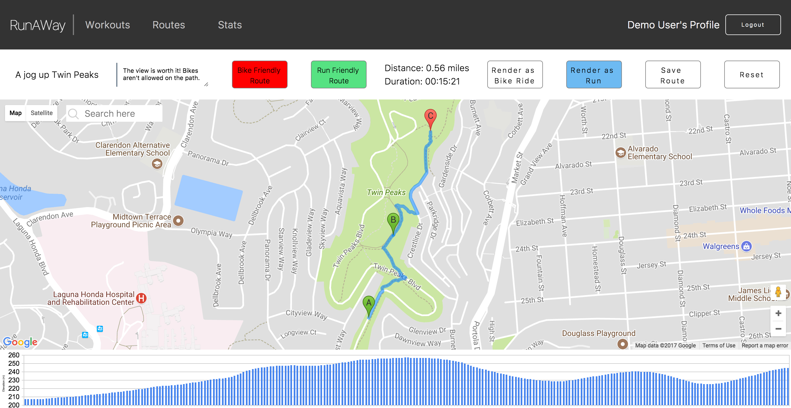
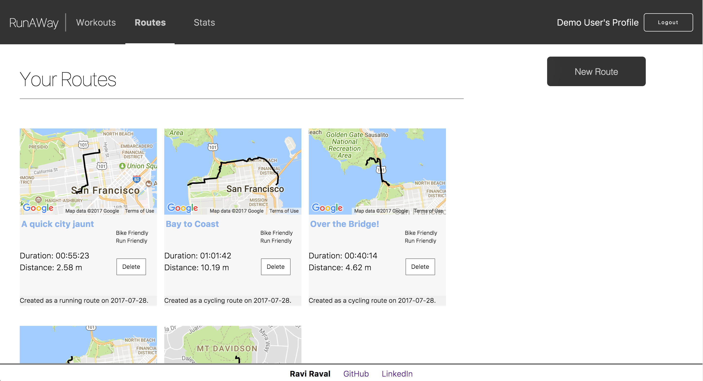
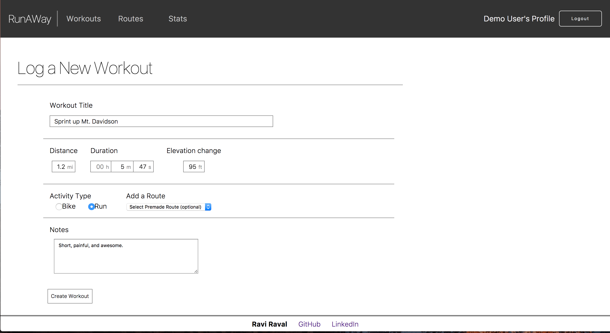
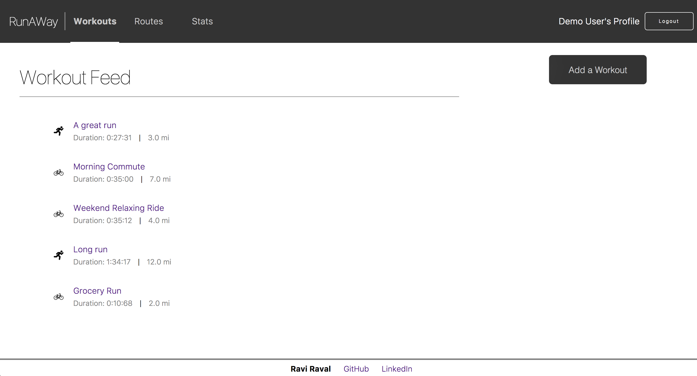

# RunAWay

***

[RunAWay](http://www.runaway.today) is a full-stack web application inspired by Strava. It utilizes Ruby on Rails on the backend, a PostgreSQL database, and React.js with a Redux architectural framework on the frontend.

## Key Features
***

#### Generating Custom Mapping Routes

  Using the Google Maps API, the route builder enables users to create and save custom cycling and/or running routes. Routes can have multiple stops (waypoints), which the user selects by clicking on a map location. The user can easily search for a desired location with a convenient search box that uses Google's Place Autocomplete service. Users

  To enhance the user experience, additional route information is provided in realtime while a user places route waypoints. Specifically, the route builder displays a precise overall route distance and estimated duration. In addition, the builder generates a visually appealing chart depicting elevation as the route progresses.

#### Displaying User Routes

On the main routes page, users can view a gallery of their saved routes. Each route has a miniature projection of itself on the Google Maps API. Listed below this minimap are the route's key characteristics: title, distance, estimated duration, date of creation, and accessibility via bicycle/foot.

#### Logging Personal Workouts

A core function of RunAWay is to enable users to log their workouts. Workouts can be designated as bike rides or runs, and can store their distance, duration, elevation change, notes, and a title. In addition, users can note that a certain workout was undertaken on one of that user's saved routes.

#### Displaying Previous Workouts

Users can view their previous workouts at a glance on the workout feed page. The feed is styled with a clear, straightforward perspective, helping users quickly and accurately interpret the data. Clicking one of the feed items takes the user to a more detailed view of that item. 

Additional Resources

[Database Schema](./schema.md)
[API Endpoints](./api-endpoints.md)
[Sample Redux State](./sample-state.md)

## Potential Features

RunAWay's core functionality could be improved upon with the following features:

*  Social Networking: users could "friend" other users, enabling messaging, sharing of routes, and the addition of friends' workouts on each user's workout feed page.

*  Global Statistics: users could view a global leaderboard and additional stats based on all RunAWay users.

*  Edit Routes: users could edit previously saved routes.

*  User Profile Details & Editing: users could view their personal profile statistics, such as account age, and could store and edit additional personal information, such as age, gender, caloric intake, etc.
*  Calendar: users could view a weekly / monthly feed of their workouts.
